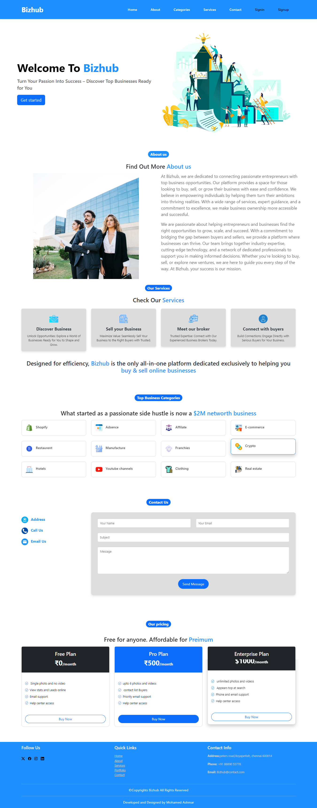
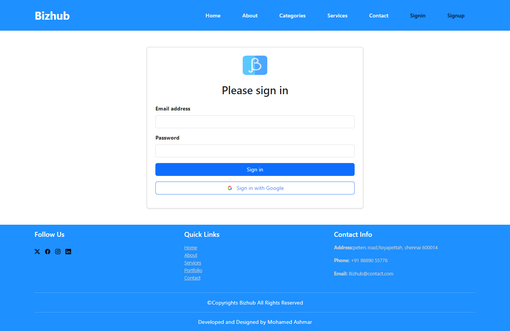
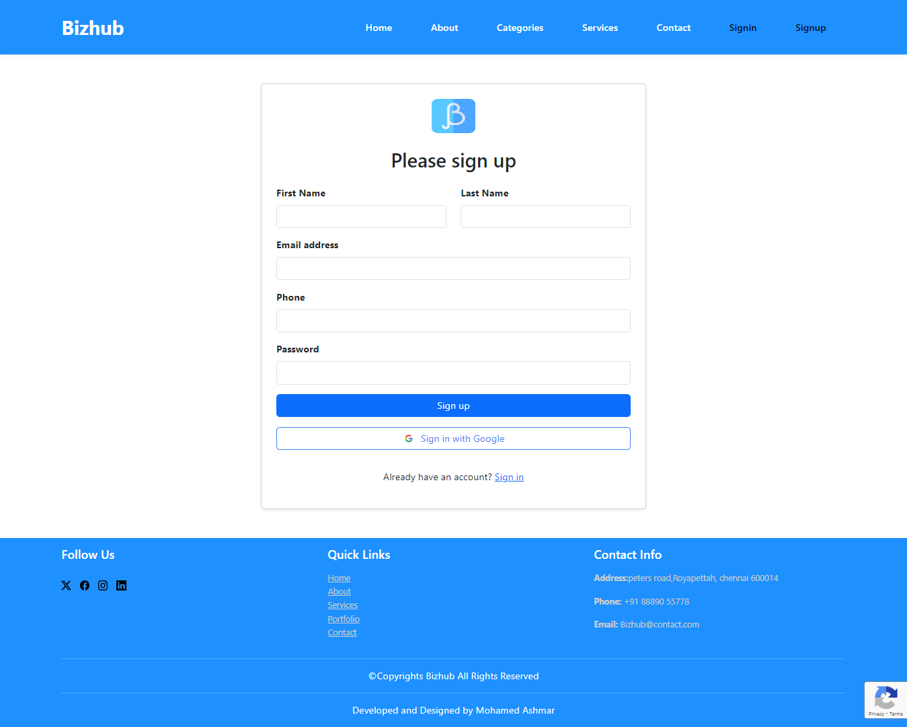
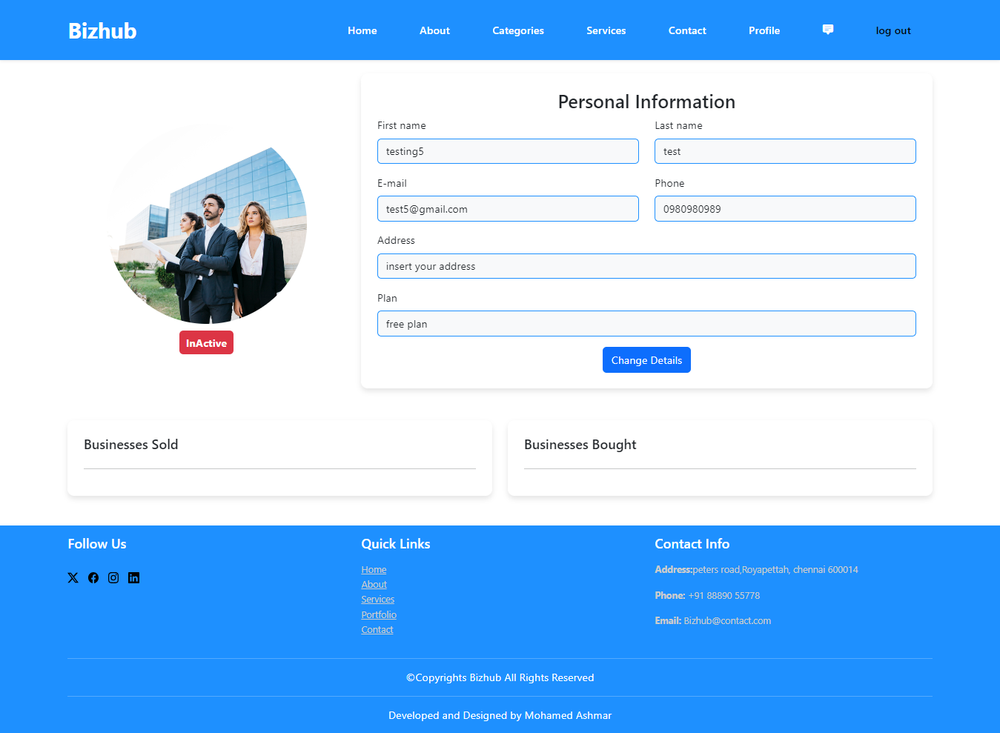
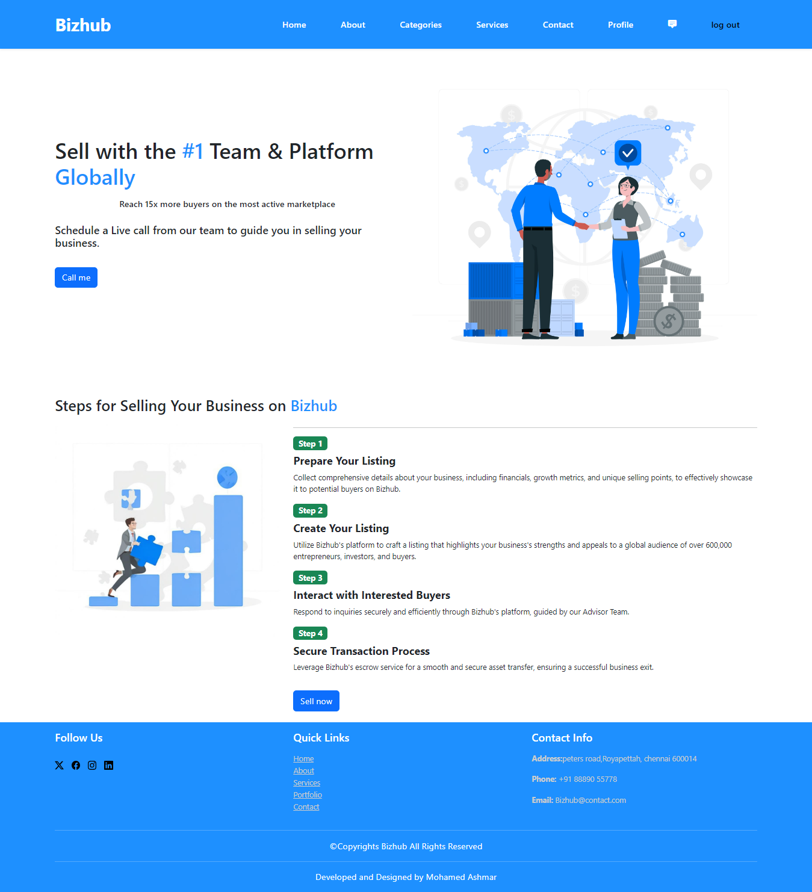
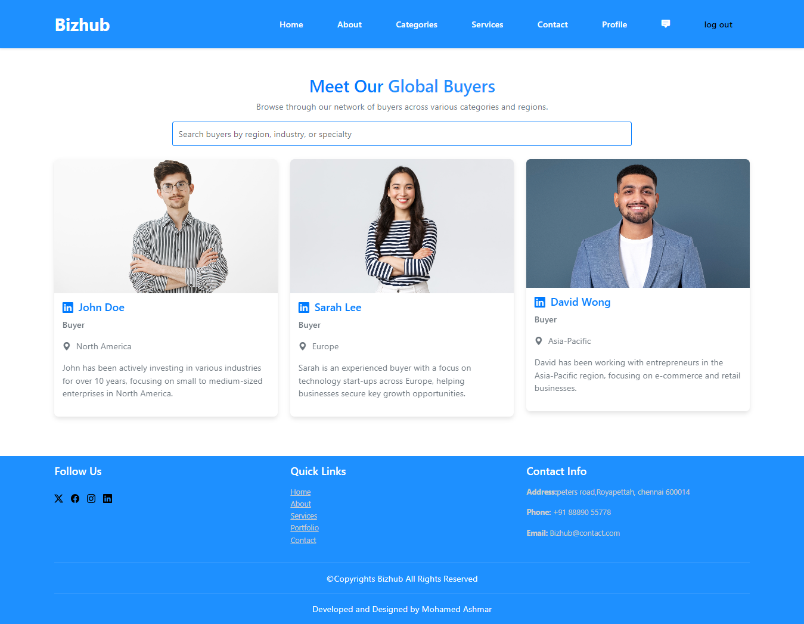
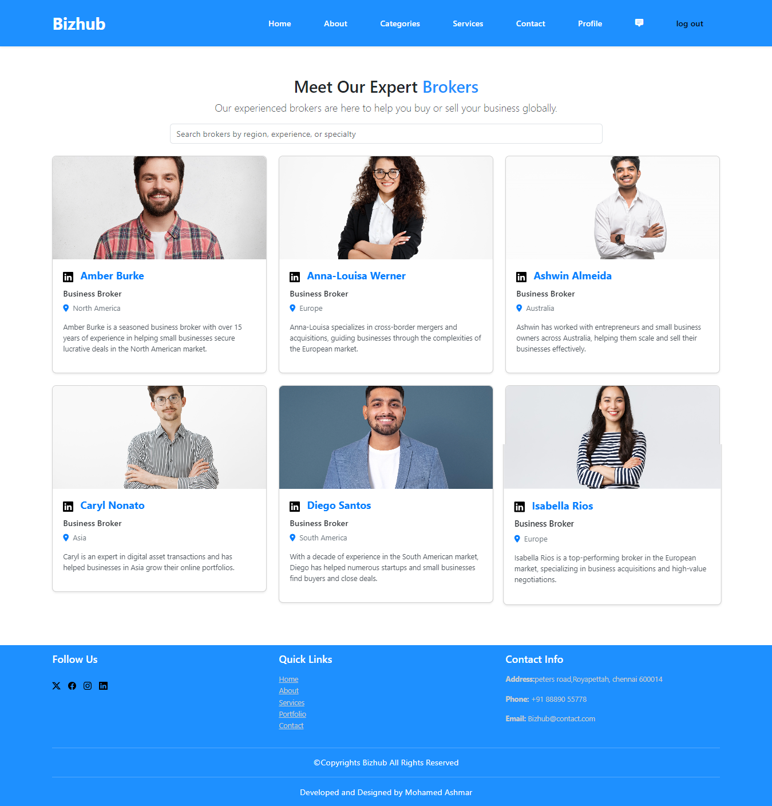
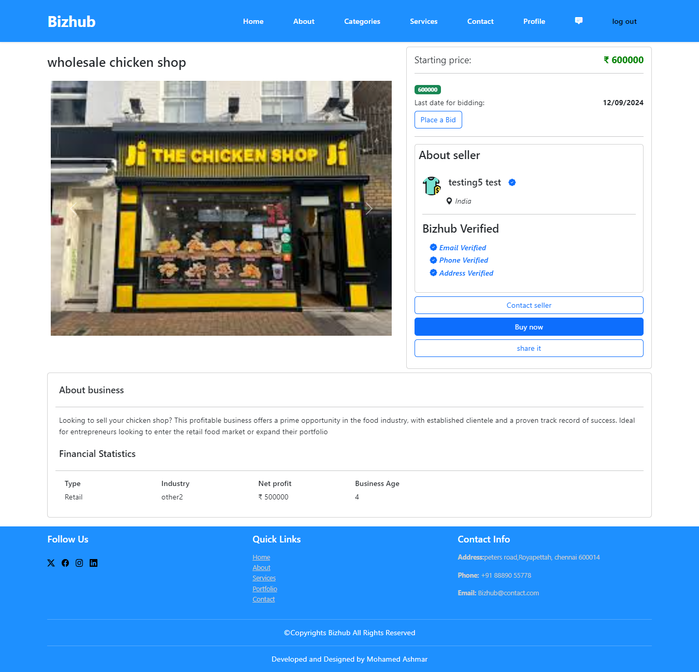
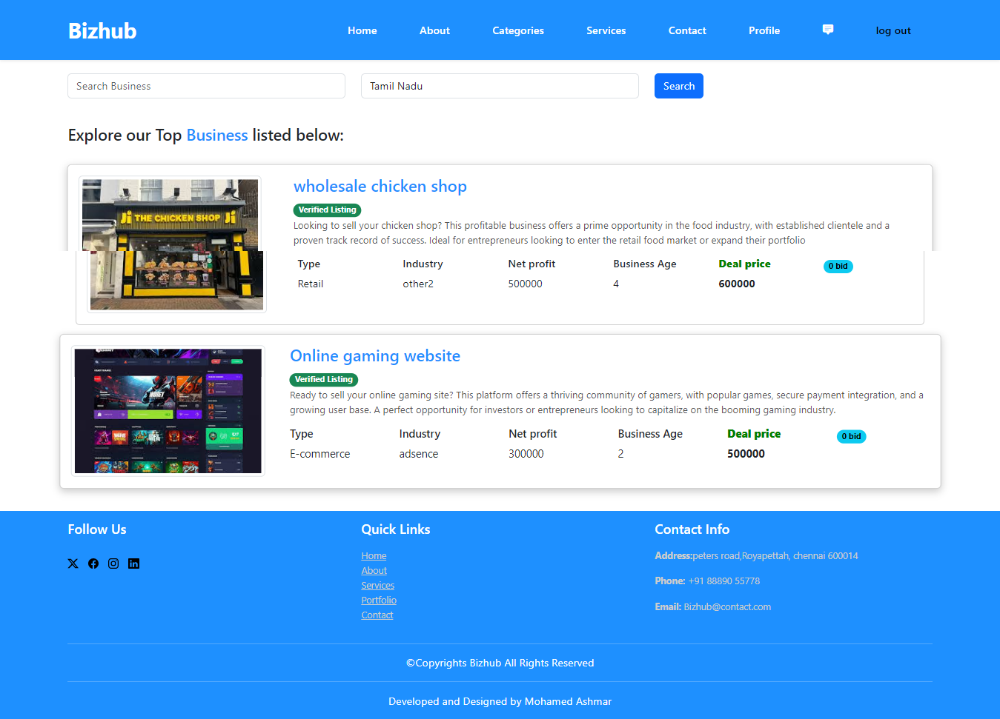

# Online Business Marketplace

This project is an innovative platform designed for buying and selling businesses online, offering a seamless experience for both buyers and sellers. It allows users to register, create profiles, and manage their business listings easily. The platform is equipped with a secure authentication system using Google OAuth for quick and safe sign-ins, enhanced by Google reCAPTCHA for spam protection. The marketplace provides features for sellers to list their businesses with detailed descriptions, images, and categories, making it easy for potential buyers to browse and find opportunities.

Built using a combination of PHP and MySQL, the platform ensures high performance and security. It includes user session management, allowing for personalized experiences and the ability to track business deals. Additionally, the responsive design ensures that the platform works smoothly on all devices, from desktops to mobile phones.

To further enhance the user experience, the platform integrates animation effects using animate.css, adding a modern touch to the interface. The site also supports real-time communication between buyers and sellers, allowing for inquiries, negotiations, and transactions to happen seamlessly.

Backend operations are optimized for security and scalability, with sensitive data like API credentials and database connections managed through a secure .env file, keeping the application secure even when deployed on public servers like GitHub. The platform is scalable, robust, and built with future enhancements in mind, allowing for easy addition of new features like business analytics, detailed search filters, and recommendations.

This project demonstrates strong backend development, user authentication, and a focus on delivering a user-friendly marketplace that serves business professionals looking to buy or sell businesses.


## Features

- User Authentication and Security

- Business Listings.

- Responsive Design.

- Real-Time Communication(future integration)

- Animation and UX Enhancements.

- User Profiles and Dashboards.


## Installation

Quick start with your development environment

```bash
git clone https://github.com/Mohamedashmar432/Online-Business-Marketplace.git
cd Online-Business-Marketplace
```
- If Node.js is not installed on your machine, download and install it from [Node.js official website](https://nodejs.org/)

- This will also install npm (Node Package Manager) with Node.js, which is required to install Sass.

- Run the following command to initialize the project in  DIR: `online-business-Marketplace/tools`

```
npm init -y
```
- This will create a package.json file in your project directory, which will track all dependencies.

- To install Sass, use the following command

```
npm install sass --save-dev

```

- To convert all sass/scss file to css file run this command in `tools` DIR

```
npx sass ./sass/styles.scss ../src/assets/css/style.css

```
- set up your database with server or XAMP server 

- Import `database.sql`(file located in root directory of this repo) file to your mysql server to create database schema.

- create an file `config.json` and enter your crdentials in below format and place it one step before your Root folder.

```
 {
    "google_oauth": {
        "client_id": "  your_Client_Id",
        "client_secret": "Your_Client_Secret"
    },
    "recaptcha": {
        "secret": "Your_recaptcha_secret",
        "id": "Your_recaptcha_id"
    },
    "database": {
        "servername": "Your_db_servername",
        "username": "Your_db_username",
        "password": "Your_db_password",
        "dbname": "Your_db_name"
    }
}
```
- To setup Google OAuth, visit [this guide](https://developers.google.com/identity/protocols/oauth2).

- To setup Google recaptcha, visit [this guide](https://www.google.com/recaptcha/about/)

- If you don't have composer , Install composer [install command from official site](https://getcomposer.org/download/)


- If you have composer , run this command in DIR :```online-business-Marketplace/tools```

```
composer update

```

- Installation done .

- Check your localhost.

    
## Screenshots
#### Landing page

#### signin Page

#### signup page

#### profile Page

#### Selling Page

#### Buyer list page

#### broker lsit page

#### business page

#### business list page



